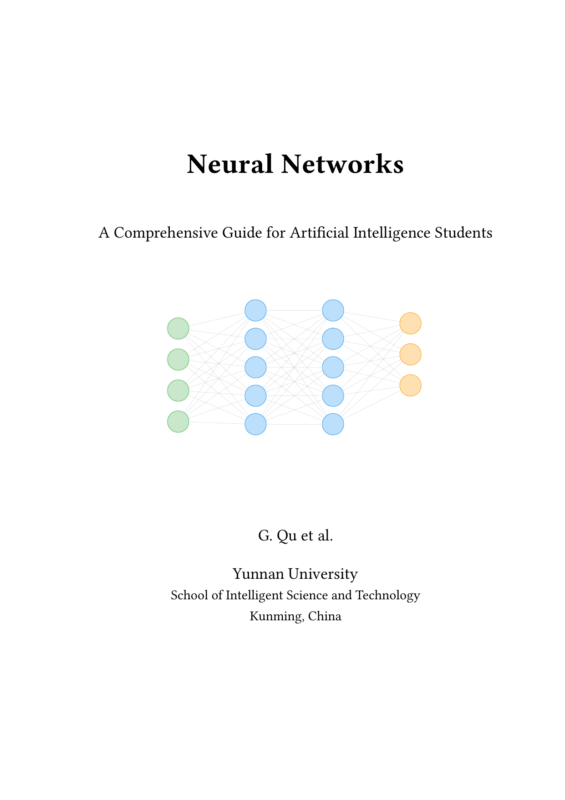

<p align="center">

</p>

## Features

- Comprehensive coverage from mathematical foundations to state-of-the-art architectures
- Rigorous mathematical derivations with intuitive explanations and proofs
- Chronological treatment of classic architectures — from LeNet (1998) to ViT (2020) and beyond
- Practical PyTorch implementation examples throughout every chapter
- In-depth treatment of the Transformer architecture and modern large language models
- End-to-end coverage of the training pipeline: data processing, optimization, regularization, and deployment
- Every chapter includes exercises for self-assessment and deeper exploration
- Extensive, carefully verified bibliography with citations to seminal papers

## Table of Contents

| Ch. | Topic |
|:---:|:---|
| 1 | Mathematical Foundations |
| 2 | Activation Functions |
| 3 | Loss Functions |
| 4 | Neural Network Architectures (DNN, CNN, RNN) |
| 5 | Core Operations (Convolution, Pooling, Normalization) |
| 6 | Skip Connections & Attention Mechanisms |
| 7 | Optimizers & Learning Rate Schedulers |
| 8 | Classic Network Architectures |
| 9 | Parameter & Computation Analysis |
| 10 | Training Process & Frameworks |
| 11 | Dataset Processing |
| 12 | Transformer Architecture |
| 13 | Modern Training Techniques |

## Project Structure

```
NeuralNetwork-Textbook/
├── .vscode/                # VS Code configuration
│   └── settings.json       # LaTeX Workshop compilation settings (see details below)
├── Eng/               
│   ├── opening/            # Front matter (title page, abstract, acknowledgements, etc.)
│   ├── text/
│   │   ├── chapters/       # Main chapters (chapter-01 ~ chapter-13)
│   │   └── appendix/       # Appendix
│   ├── bibliography/       # References
│   ├── glossary/           # Glossary
│   ├── style/              # LaTeX style files
│   ├── cover.png           # Cover of the textbook
│   ├── main.pdf            # Downloadable textbook
│   ├── main.tex            # Main compilation entry
│   └── Makefile
├── LICENSE                 # License file
└── README.md               # README

```

## .vscode Configuration

The `.vscode/settings.json` file configures **VS Code LaTeX Workshop** for optimal compilation:

- **Compilation pipeline**: `pdflatex → biber → pdflatex → pdflatex → biber → pdflatex → pdflatex` (7 steps)
  - This ensures complex bibliographic systems with cross-references converge completely
- **Auto-compilation**: Files are compiled automatically when saved (with 1-second debounce)
- **PDF viewer**: Built-in VS Code tab viewer with SyncTeX support for reverse search
- **Special characters**: Biber's `--output-safechars` flag ensures proper handling of Unicode characters

If you customize the LaTeX compilation process, modify `.vscode/settings.json` to adjust the tools and recipes.

## Build

### Prerequisites

- **TeX Live 2024+**
- **Biber** — for bibliography processing

### Compilation

#### Option 1: Using VS Code LaTeX Workshop (Recommended)

1. Open the project folder in VS Code
2. Install the **LaTeX Workshop** extension (if not already installed)
3. Open any `.tex` file in the `Eng/` directory
4. The compilation will start automatically when you save the file
5. View the generated PDF in the VS Code tab panel

**How it works:**
- The `.vscode/settings.json` configuration defines a 7-step compilation pipeline
- Files are compiled automatically with a 1-second debounce after saving
- Biber processes bibliography automatically as part of the pipeline
- PDF updates in real-time in the VS Code viewer

**Compile times:**
- First compilation: ~60-90 seconds (includes bibliography processing and 12 chapters)
- Subsequent edits: ~20-30 seconds
- Regular content changes: ~15-20 seconds

#### Option 2: Using Make (Command Line)

```bash
cd Eng
make pdf
```

This uses the traditional `Makefile`-based compilation pipeline.

### Clean up

```bash
cd Eng
make clean       # Remove auxiliary files
make cleanall    # Remove auxiliary files + PDF
```

## License

This project is licensed under [CC BY-NC-SA 4.0](https://creativecommons.org/licenses/by-nc-sa/4.0/).

## Acknowledgements

### Template

This textbook is typeset using [Alcazar](https://github.com/dpmj/alcazar) — a free and open-source LaTeX template for academic works. Thanks to Juan Del Pino Mena for this excellent template.

> Del Pino Mena, J. (2024). Alcazar: A free and Open-Source LaTeX template for academic works. Zenodo. https://doi.org/10.5281/zenodo.13935260

### Academic Pioneers

Thanks to Yann LeCun, Geoffrey Hinton, Yoshua Bengio, and many other researchers whose groundbreaking work laid the foundation for modern neural networks and deep learning.

### Open-Source Community

Thanks to the developers of PyTorch, NumPy, and other tools that have made deep learning accessible to researchers and practitioners worldwide.
